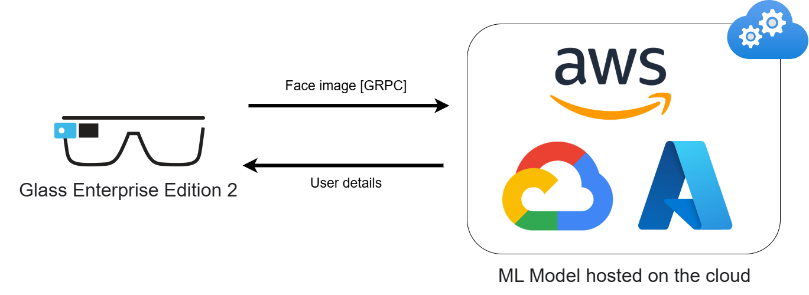

# Google glass face recognition
This repository contains the java code for Android, to be ran on Google Glass Enterprise Edition 2 (GGEE2), to provide the face recognition service.

Due to the limited technical specs of the GGEE2 (descirbed below), I've opted to outsource the image processing and face recognition to a cloud service (such as https://cloud.google.com/vision/docs/detecting-faces), and simply take the picture with GGEE2, and then send it via gRPC client-side streaming.

Warning - due to the discontinued support of GGEE2 (https://developers.google.com/glass-enterprise), you are likely to encounter issues when trying to work with Android 8.1 Oreo that is preinstalled on your device. 

## GG EE2 Technical specs

| Specification      | Detail                                           |
| :----------------- | :----------------------------------------------- |
| System on Chip (SoC) | Qualcomm Snapdragon XR1 (Quad Core, 1.7 GHz, 10nm) |
| Operating System   | Android Open Source Project 8.1 (Oreo)           |
| Memory (RAM)       | 3GB LPDDR4                                       |

## GestureLibrarySample
GestureLibrarySample (or Gesture Detector Sample) is sample code responsible for how to detect and respond to user gesture events on the touchpad. It's required to re-map the touch commands to take a picture via GG EE2. Backup of https://github.com/googlesamples/glass-enterprise-samples.

## GoogleGlassFaceRecognition
Modified camera app, that takes the picture and then sends it with the sendImageViaGRPC function. 

## Glass_WebView
WebView, allowing GGEE2 users to browse a website of their choice.

## GallerySample
Gallery, used to view pictures taken with GG. Copy of https://github.com/googlesamples/glass-enterprise-samples.
